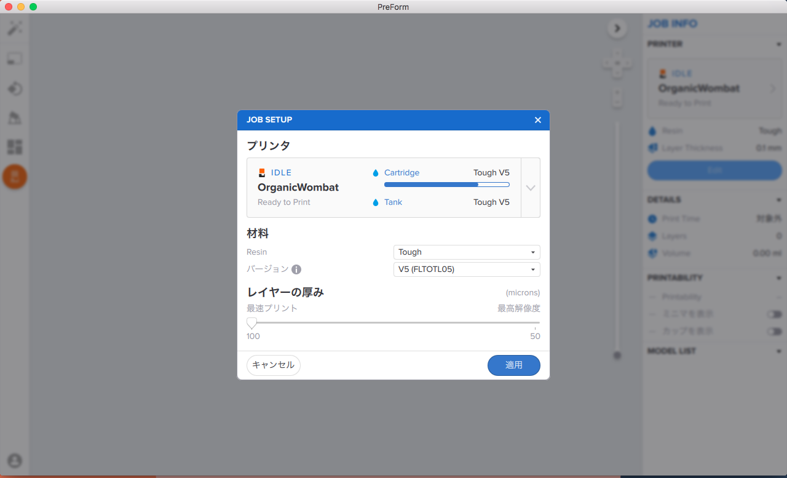
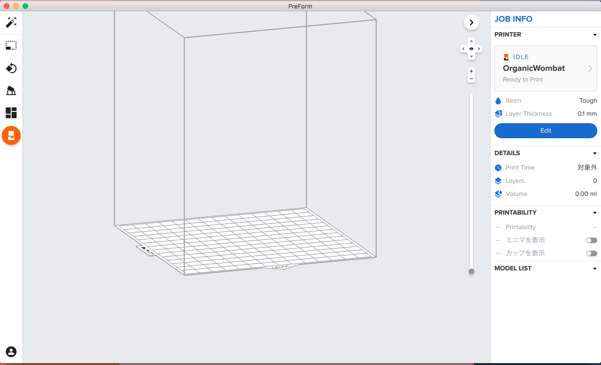
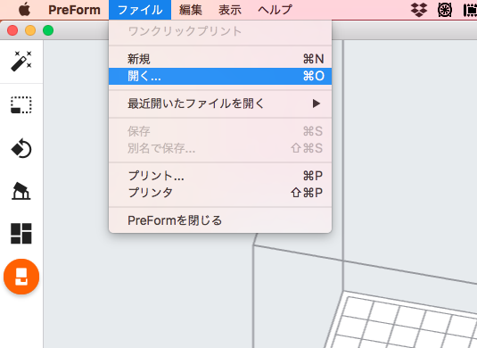
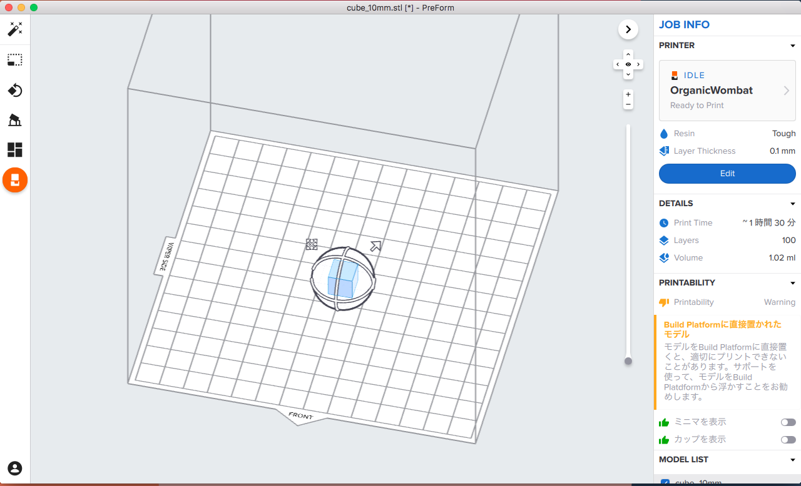
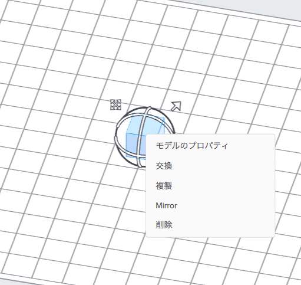

# 01.PreForm／データの読み込み
  

 
 

**PreForm**を起動します。 
 
 
 

 
 

上記のような画面が表示されたら「プリンタ」から自分の使用するマシンを選択し、 
「材料」の設定も合わせて行います。 
 
 
 

 
 

ソフトが起動すると上記のような画面が表示されます。 
 
 
 

 
 

**ファイル** ＞ **開く**でデータを開くか、ウィンドウ内に直接ドラッグ&ドロップします。 
 
 
 

 
 

データが読み込まれます。 
 
 
 

 
 

オブジェクト（データ）上で右クリックすると、上記のようなメニューが表示されます。 
 
 
 
 
 
 
