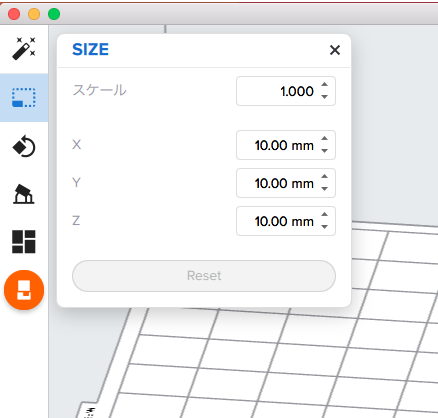

# 02.PreForm／データのセットアップ
  

  
 

**「ONE-CLICK PRINT」**をクリックすると、オブジェクトに自動的にサポートやラフトがつけられます。 
 
 
 

 
 

**「SIZE」**を選択すると、オブジェクトのサイズを変更できます。 
 
 
 

 
 

**「ORIENTATION」**を選択すると、オブジェクトのプリント方向を変更できます。 
 
 
 

 
 

**「Auto-Orient Selected」**をクリックすると、 
オブジェクトをプリントしやすい角度に自動的に変更してくれます。 
 
 
 

 
 

**「SUPPORTS」**を選択すると、オブジェクトをプリントするときに必要なサポートを追加することができます。 

* **「密度」：**どれくらいの密度でサポートをいれるか。数値を上げるほど密度も上がる。
* **「タッチポイントのサイズ」：**サポートとオブジェクトの接点のサイズ。
* **「内側のサポート」：**オブジェクトの内側に空洞があった場合、そこにサポートを入れるかどうか。
* **「ラフトラベル」：**モデル（オブジェクト）名を、ラフトにプリントするかどうか。
* **「Raft Type」：**どんなラフトを付けるか。Raftは通常サイズ、Mini-Raftsは小さいラフトを付ける。
* **「ビルドプラットフォーム上」：**チェックを入れると、オブジェクトを直接ビルドプラットフォーム上にプリントする。

 
 
 
 

 
 

**「Auto-Generate Selected」**をクリックすると、自動的にサポートが生成されます。 
**「編集」**をクリックすると、サポートの位置や有無を直接編集できます。 
 
 
 

 
 

**「LAYOUT」**を選択すると、複数オブジェクトをプリントする場合の配置位置を設定できます。 
 
 
 

 
 

**「全てのレイアウト」**をクリックすると、自動的に複数オブジェクトを配置してくれます。 
 
 
 
