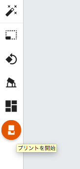
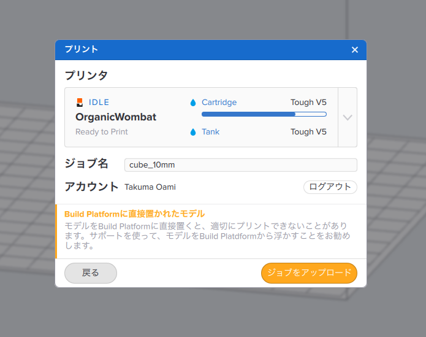
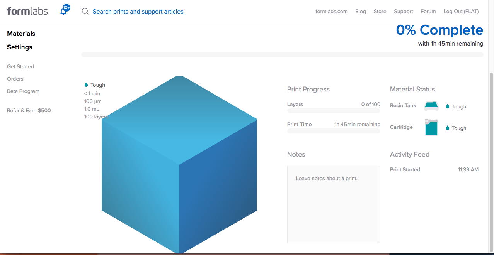

# 03.PreForm／データ送信
  

 
 

**「プリントを開始」**をクリックすると、データをマシンに送ることができます。 
このとき、PCとマシンは同じWifiにつなげておく必要がある。 
 
 
 

 
 

上記のような画面が表示されたら、プリンタ名、ジョブ名を確認し、 
問題がなければ**「ジョブをアップロード」**をクリックします。 
 
 
 

 
 

無事にアップロードできたらWebブラウザでDashboardを開きます。 
ここでプリントの進行状況などを確認できます。 
 
 
 
 
 
 
