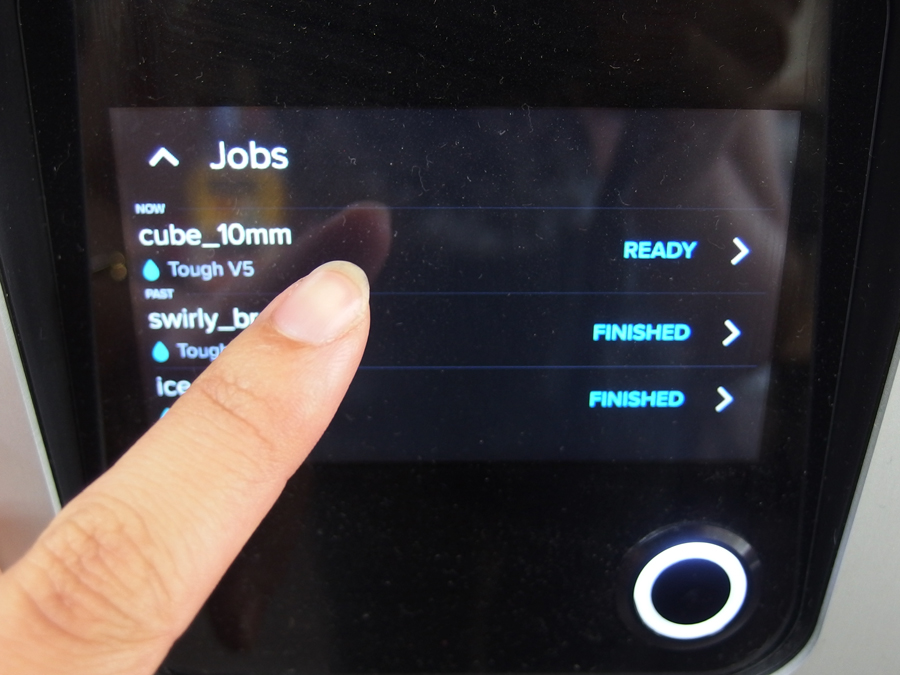
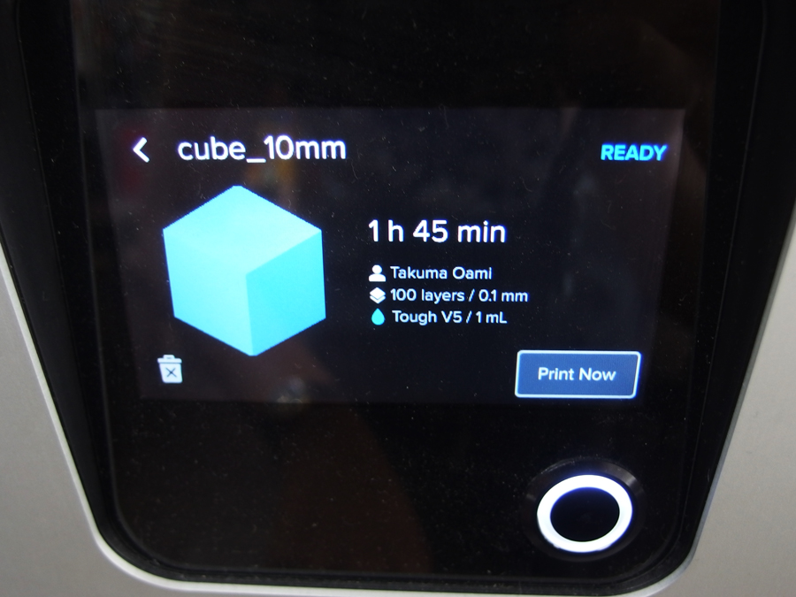
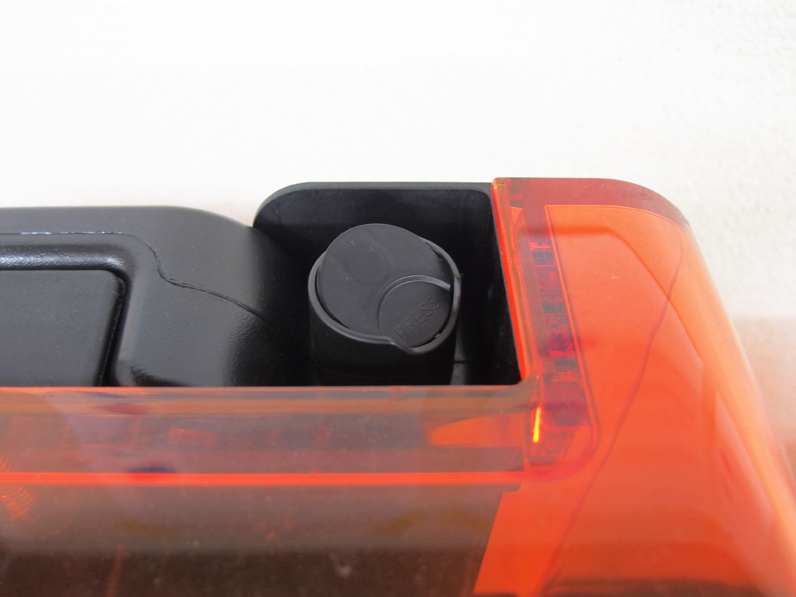
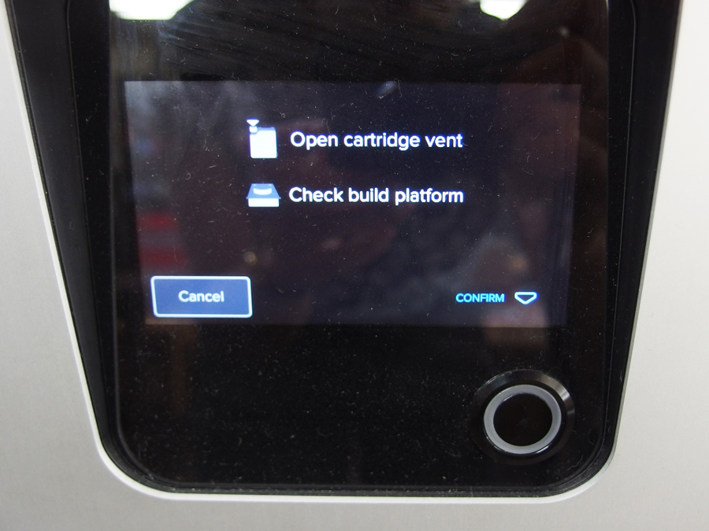

# 04.マシンのセットアップ〜印刷
  

 
 

マシンのディスプレイに送信したデータ名が表示されているので、タッチしてデータを選択します。 
 
 
 

 
 

データの内容を確認し、問題がなければ**「Print Now」**をタッチします。   
 
 
 

 
 

マシン後部にセットされているインクカートリッジの蓋を押して開けます。 
 
 
 

 
 

インクカートリッジの蓋を開け、ビルドプラットフォームに何も付着していないことを確認したら、 
**「CONFIRM」**を押してプリントを開始します。 
 
 
 
 
 
 
