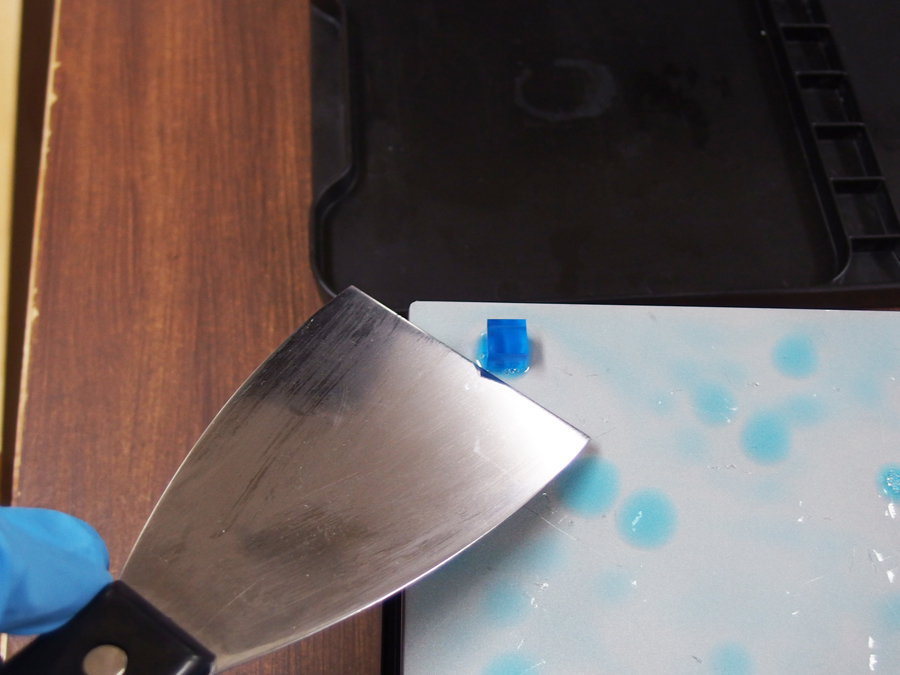

# 05.オブジェクトの取り外し〜洗浄
  

**※この作業を行うときには、必ず手袋を装着すること！**
 
 
 

 
 

プリントが完了したら、インク漏れ防止のために、まずはインクカートリッジの蓋を閉じます。 
 
 
 

 
 

マシンのカバーを開きます。  
 
 
 

 
 

プラットフォームのストッパーを上げます。 
 
 
 

 
 

プラットフォームの上部を持ち、ゆっくり手前に引っ張ります。（底面にレジンが付いているので注意！） 
 
 
 

 
 

持ち手を下にしてテーブルに置いておきます。 
 
 
 

 
 

プラットフォームのストッパーを下げ、マシンのカバーを閉じます。 
 
 
 

 
 

ヘラを使ってプラットフォームからオブジェクトをはがします。 
（このとき、ヘラでプラットフォームを傷つけないように！） 
 
 
 

 
 

オブジェクトはIPAで洗浄します。 
はじめに、①と書かれた洗浄槽にオブジェクトを入れ、30秒程度すすいだのちに10分放置します。 
その後、②の洗浄槽にオブジェクトを入れて、30秒程度すすいだのちに10分放置します。 
完了したら乾燥させ、必要であればUVライトを当てて追硬化させます。 
 
 
 
 
 
 
