# 06.造形サンプル
  

## 06-1. 10mm四方のキューブ（ベッドに直接配置）
 

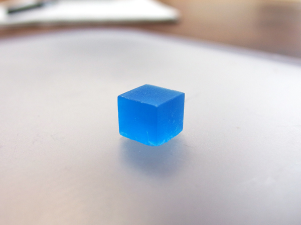 

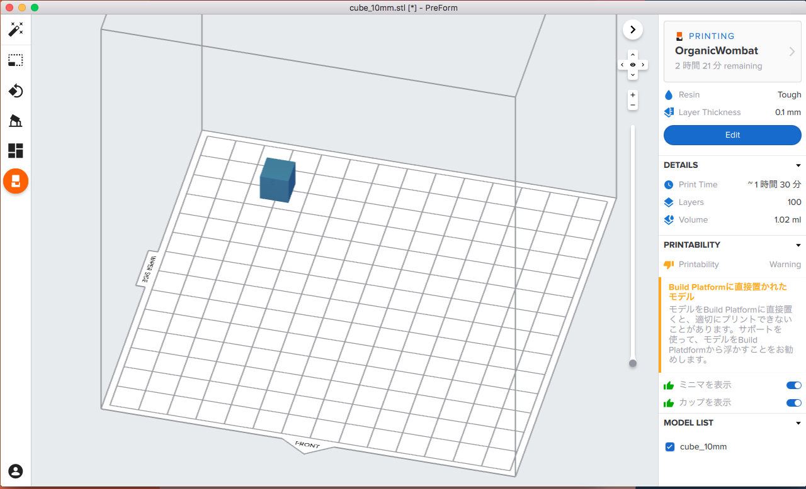 

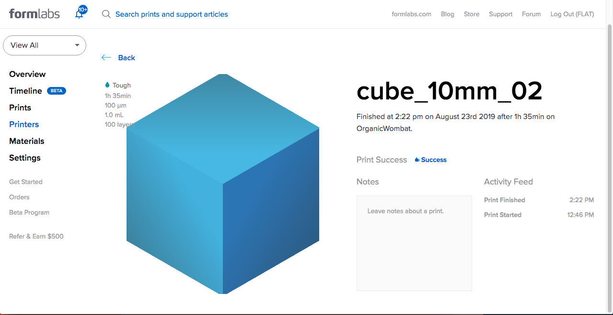 
 

* レジン：Tough
* 積層ピッチ：0.1mm
* プリント時間：1時間45分（レジン加熱時間を含む）
* レイヤー数：100
* 材料使用量：1.02ml
* プリントベッドに直接配置（ラフトなし） 
  →そのため、ベッドに接していた層が造形物から剥離してしまった。（0.5mmくらい？）
* 参考料金：基本料金¥2,000 + 材料費¥50 x 1.02ml = ¥2,050\(税込／小数点以下四捨五入）
 
 
 
 

## 06-2. 10mm四方のキューブ（ラフトとサポートあり）
 

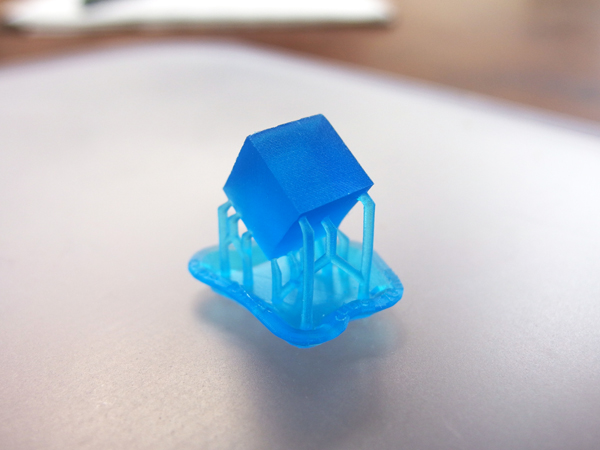 

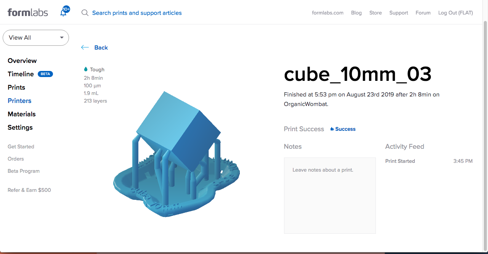 
 

* レジン：Tough
* 積層ピッチ：0.1mm
* プリント時間：2時間15分（レジン加熱時間を含む）
* レイヤー数：213
* 材料使用量：1.9ml
* サポート&ラフトを自動生成（ラフトは通常のもの、ラフトラベルあり）
* 参考料金：基本料金¥2,000 + 材料費¥50 x 1.9ml = ¥2,095\(税込／小数点以下四捨五入）
 
 
 
 

## 06-3. 10mm四方、1mm厚の壁で構成されたキューブ
 
※中空のため、直径3.5mmの穴を1箇所あけています。
 

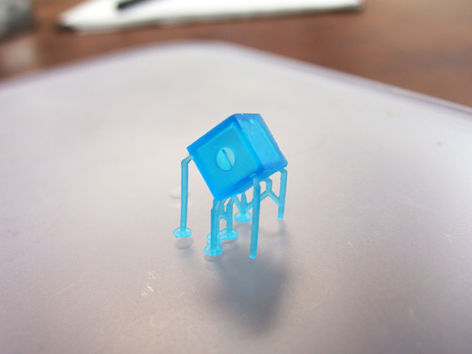 

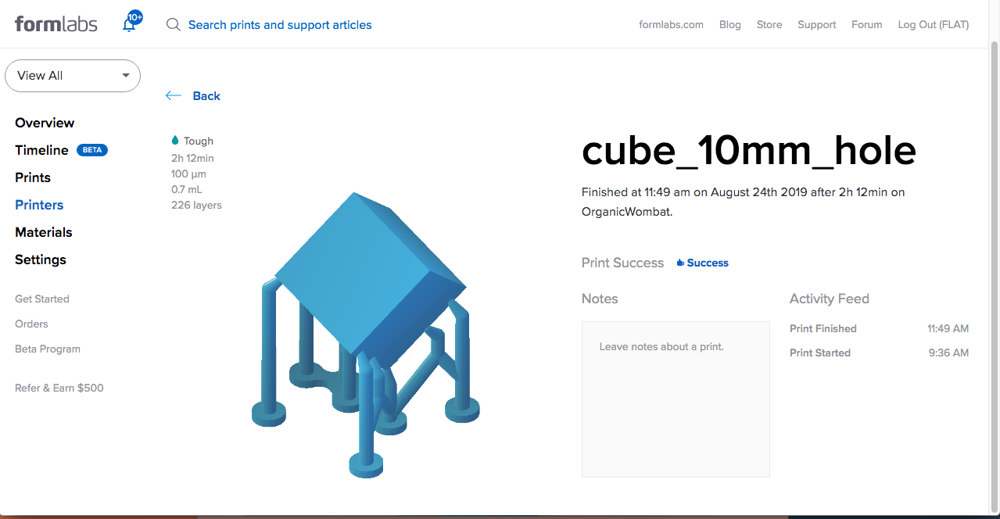 
 

* レジン：Tough
* 積層ピッチ：0.1mm
* プリント時間：2時間30分（レジン加熱時間を含む）
* レイヤー数：226
* 材料使用量：0.7ml
* サポート&ラフトを自動生成（ラフトはミニラフト、内側のサポートなし）
* 参考料金：基本料金¥2,000 + 材料費¥50 x 0.7ml = ¥2,035\(税込／小数点以下四捨五入）
 
 
 
 

## 06-4. Thingiverseからダウンロードした形状を縮小してプリント
 

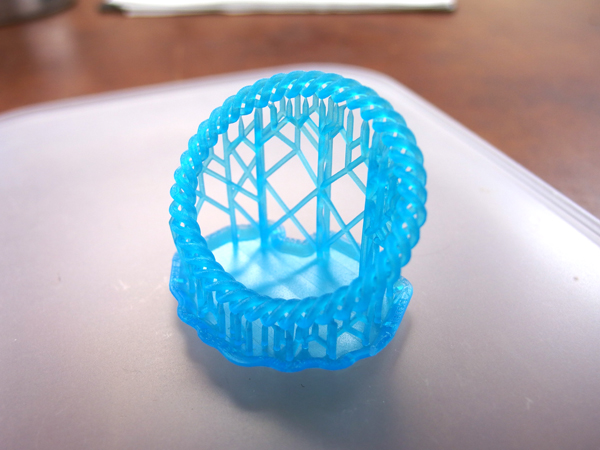 

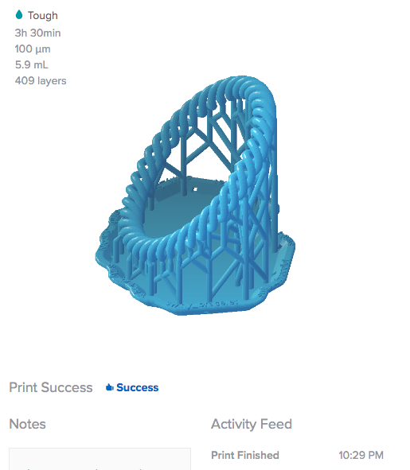 
 

* レジン：Tough
* 積層ピッチ：0.1mm
* プリント時間：3時間30分（レジン加熱時間は除く）
* レイヤー数：409
* 材料使用量：5.9ml
* サポート&ラフトを自動生成（ラフトは通常のラフト、ラフトラベルあり）
* 参考料金：基本料金¥2,000 + 材料費¥50 x 5.9ml = ¥2,295\(税込／小数点以下四捨五入）
 
 
 
 

## 06-5. Thingiverseからダウンロードした形状を、高さ45mmに縮小してプリント
 

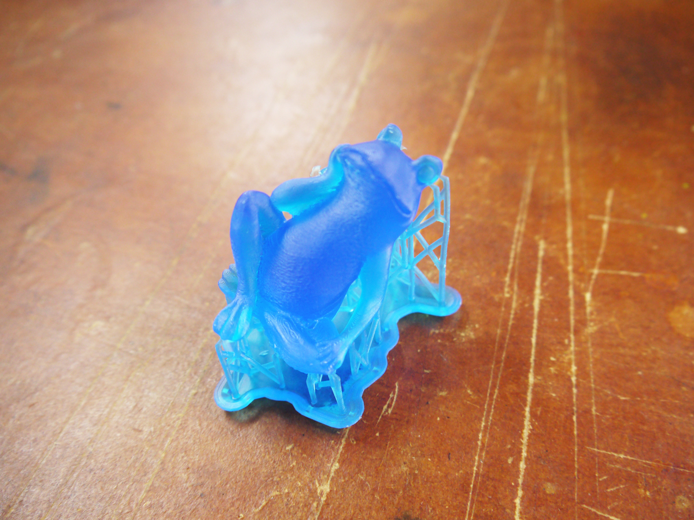 

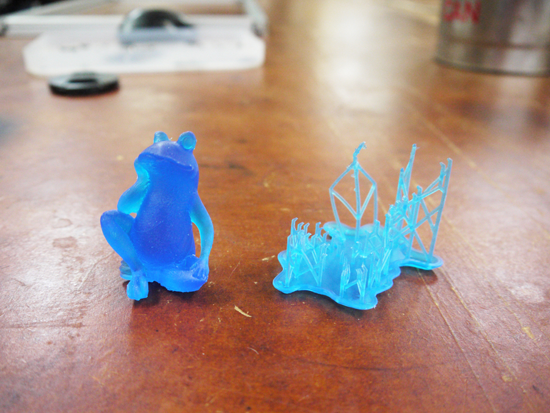 

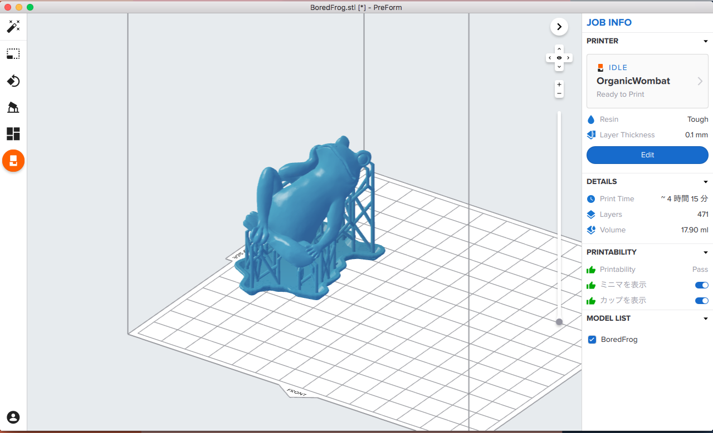 
 

* データ：[Bored Frog](https://www.thingiverse.com/thing:1170378)
* レジン：Tough
* 積層ピッチ：0.1mm
* プリント時間：4時間20分（レジン加熱時間は除く）
* レイヤー数：471
* 材料使用量：17.9ml
* サポート&ラフトを自動生成 
  サポート：密度0.80, タッチポイントのサイズ0.60mm, 内側のサポートなし 
  ラフト：通常のラフト、ラフトラベルなし
* 参考料金：基本料金¥2,000 + 材料費¥50 x 17.9ml = ¥2,895\(税込／小数点以下四捨五入）
 
 
 
 
